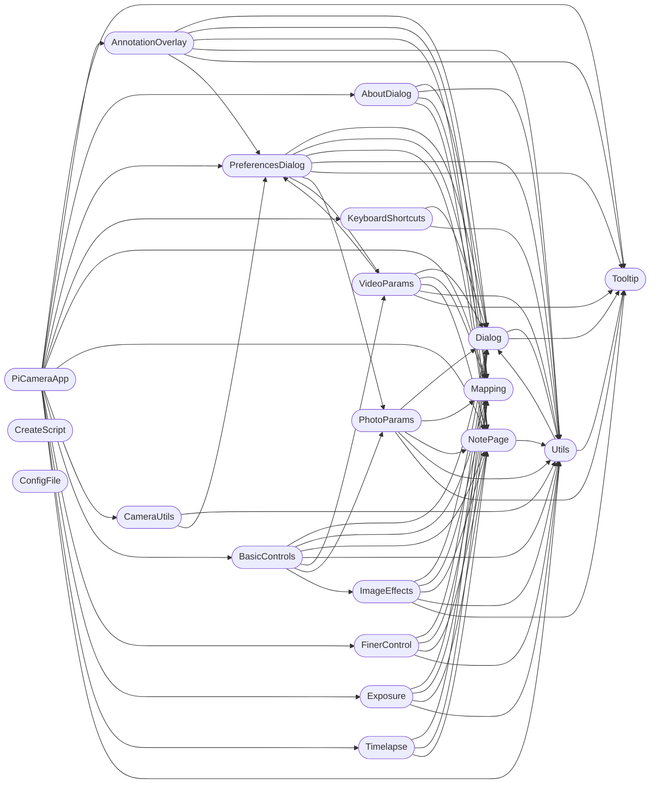

# Code Overview

[_Documentation generated by Documatic_](https://www.documatic.com)

<!---Documatic-section-Codebase Structure Python-start--->
## Codebase Structure Python

The codebase has a flat structure, with 20 code files.

<!---Documatic-block-system_architecture-start--->

<!---Documatic-block-system_architecture-end--->

# #
<!---Documatic-section-Codebase Structure Python-end--->

<!---Documatic-section-File IO-start--->
## File IO

<!---Documatic-block-file_io-start--->
The following files have file read operations

<!---Documatic-block-Source-start--->

	
<code>Source</code> (Click to Expand!)

* Source.AboutDialog: Assets/PiCamera.png, Assets/gpl.txt
* Source.AnnotationOverlay: Assets/ColorPicker1.png
* Source.BasicControls: Assets/reset.png
* Source.KeyboardShortcuts: Assets/keyboard.gif
* Source.PiCameraApp: Assets/camera-icon.png, Assets/flip.png, Assets/flip.png, Assets/rotate.png, Assets/video-icon-b.png
* Source.PreferencesDialog: Assets/camera-icon.png, Assets/computer-monitor.png, Assets/files.png, Assets/help.png, Assets/video-icon-b.png
* Source.Tooltip: Assets/Tooltips.txt
* Source.Utils

<!---Documatic-block-Source-end--->
<!---Documatic-block-file_io-end--->

# #
<!---Documatic-section-File IO-end--->

<!---Documatic-section-Class Hierarchy-start--->
## Class Hierarchy

<!---Documatic-block-Frame-start--->

	
<code>Frame</code> (Click to Expand!)

* Source.NotePage.BasicNotepage

<!---Documatic-block-Frame-end--->

<!---Documatic-block-Source.NotePage.BasicNotepage-start--->

	
<code>Source.NotePage.BasicNotepage</code> (Click to Expand!)

* Source.AboutDialog.About
* Source.AboutDialog.Credits
* Source.AboutDialog.License
* Source.AnnotationOverlay.AnnotationPage
* Source.AnnotationOverlay.OverlayPage
* Source.FinerControl.FinerControl
* Source.PreferencesDialog.General
* Source.PreferencesDialog.Interface
* Source.PreferencesDialog.Other

<!---Documatic-block-Source.NotePage.BasicNotepage-end--->

<!---Documatic-block-Source.PreferencesDialog.PreferencesDialog-start--->

	
<code>Source.PreferencesDialog.PreferencesDialog</code> (Click to Expand!)

* Source.AboutDialog.AboutDialog
* Source.AnnotationOverlay.AnnotationOverlayDialog
* Source.ImageEffects.ImageEffectsDialog
* Source.KeyboardShortcuts.KeyboardShortcutsDialog
* Source.PhotoParams.PhotoParamsDialog
* Source.PreferencesDialog.PreferencesDialog
* Source.VideoParams.VideoParamsDialog

<!---Documatic-block-Source.PreferencesDialog.PreferencesDialog-end--->

# #
<!---Documatic-section-Class Hierarchy-end--->

[_Documentation generated by Documatic_](https://www.documatic.com)